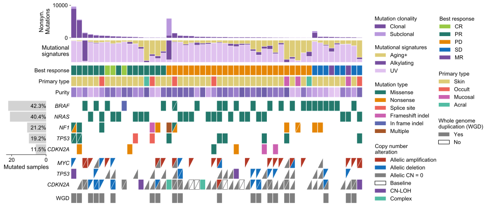

# python-comut
Repository containing code for creating comutation plots in Python

`quickstart.ipynb` gives a framework for creating basic comut plots based on input data

`tutorial.ipynb` gives more in depth documentation for CoMut, as well as provide a walkthrough using some simulated data