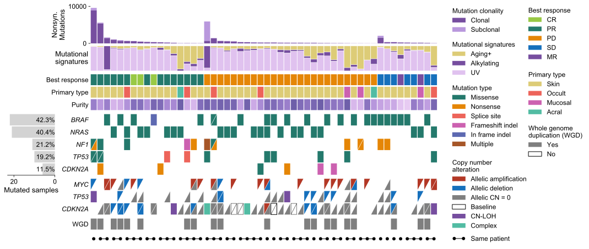

# CoMut
CoMut is a Python library for creating comutation plots to visualize genomic information.

<p align="center">

</p>


## Installation

CoMut can be installed via `pip`:

`pip install comut`

## Quickstart

There is a [Quickstart notebook](https://github.com/vanallenlab/comut/blob/master/examples/quickstart.ipynb) that can create comut plots quickly with only input data. Simply download the notebook, specify the path to your data, and run the cells to produce a basic comut. 

For those who do not want to install Python or jupyter, this notebook is also available as a [Google Colab notebook](https://colab.research.google.com/github/vanallenlab/comut/blob/master/examples/quickstart.ipynb). Here, you can upload your data and run the notebook to make a basic comut without the need for any installations.

## Documentation

There is also a [Documentation notebook](https://github.com/vanallenlab/comut/blob/master/examples/documentation.ipynb) that provides documentation for CoMut. It describes the fundamentals of creating comuts and provides the code used to generate the comut above.

## Development

If you would like to report a bug or request a feature, please do so using the [issues page](https://github.com/vanallenlab/comut/issues)

## Dependencies

CoMut runs on python 3.6 or later. CoMut requires the following packages as dependencies (they will be installed along with CoMut if using `pip`)

```
numpy>=1.18.1
pandas>=0.25.3
palettable>=3.3.0
matplotlib>=3.3.1
```

## Versions

0.0.2 - Introduce compatability for Python 3.6  
0.0.1 - Initial release